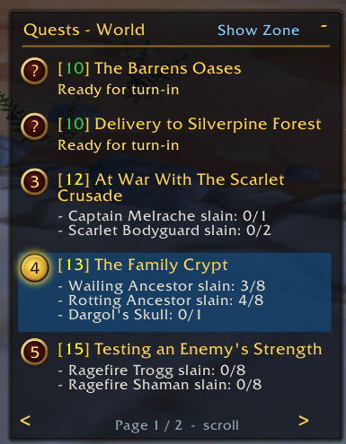
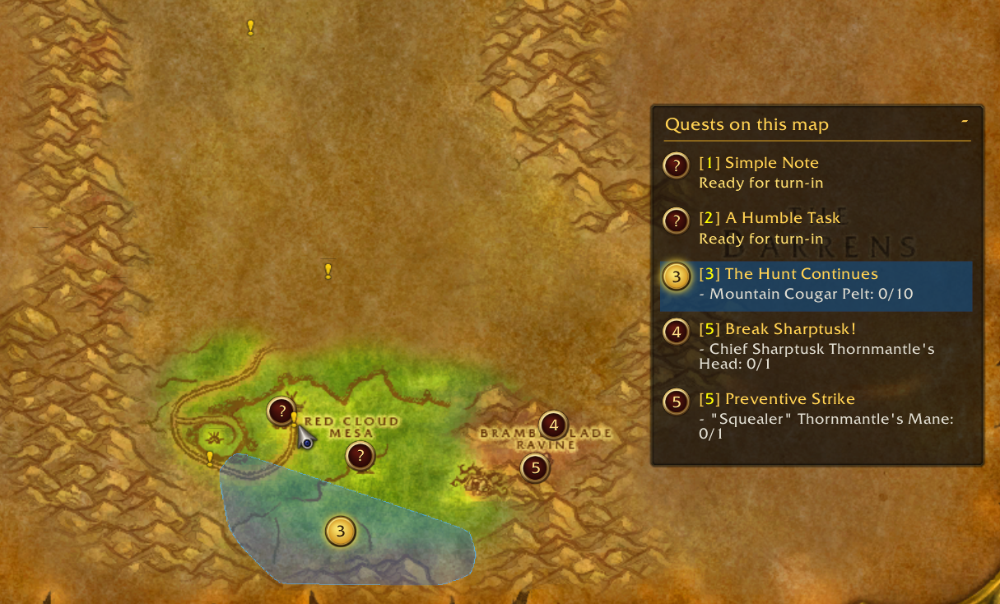

# Questline

A quest tracker for OctoWoW and Vanilla 1.12. Find quest objectives with clean map highlights, discover nearby questgivers, and track your party's progress in creature tooltips.

## Features

- Zone-based quest tracker that follows you as you travel, with a Show World toggle for your full quest log
- Quest levels with difficulty-colored numbers and level-based sorting
- Click a quest to highlight its map area without changing your tracker page or sorting
- Ctrl-click to highlight multiple quests and move the group to the top, sorted by level
- Precise action icons for single-location objectives and question marks for turn-ins
- Bag, sword, and gear spawn markers for highlighted quests on both maps; world-map spawn markers are off by default and can be enabled in Options
- Questgiver markers on the map and minimap, with combined tooltips for nearby NPCs
- Minimap question marks for ready turn-ins, taking priority over an NPC's available quests and hiding the duplicate native yellow dot
- Creature tooltips with quest objectives, item drop rates, and live progress
- Quest progress in world-object tooltips, including quest herbs and other collectibles
- Shared quest progress from party members running Questline, with class-colored names
- NPC tooltips showing available, in-progress, and completed quests
- Saved completion history with searchable records, manual-only filtering, Restore actions, and an optional server-history import
- Right-click a questgiver marker on the world map to mark an individual quest completed
- `/ql` home page with separate Options and Completed Quests screens
- Double-click a tracker quest to open its objective or turn-in map
- Shift-click to link a quest in open chat; right-click to open it in the quest log
- Movable, resizable, collapsible trackers with saved sizes, positions, and highlights
- Standalone quest database; no pfQuest dependency

## Commands

- `/ql` or `/questline` — Open options and completed quests
- `/ql help` — Show commands
- `/ql tracker on` / `/ql tracker off` — Show or hide the tracker
- `/ql maptracker on` / `/ql maptracker off` ? Show or hide the tracker on the world map
- `/ql legacy on` / `/ql legacy off` — Show or hide pfQuest's world-map pins
- `/ql reset` — Reset tracker positions and sizes, and expand both panels
- `/ql status` — Show addon version and database status

## Credits

Database material comes from pfQuest, pfQuest-turtle, and pfQuest-octo. The bag, sword, and gear marker artwork comes from pfQuest. Their MIT notices are included in `licenses/`.
